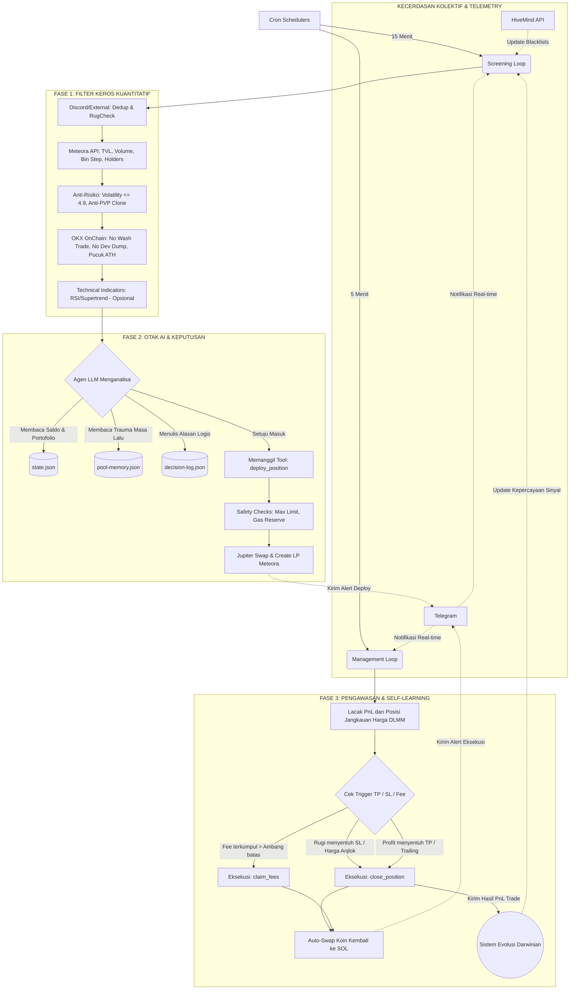

# Dokumentasi Lengkap DLMM Agent Agent: Workflow, Analisa, dan Filtering

Dokumen ini menjelaskan secara sangat mendetail (A to Z) mengenai cara kerja DLMM Agent Agent. Mulai dari cara menjalankan bot, proses *screening* koin, logika kecerdasan buatan (LLM), hingga eksekusi beli/jual (*Take Profit* & *Stop Loss*).

---

## 1. Cara Menjalankan Project (How to Run)

Sebelum menjalankan bot, pastikan konfigurasi dasar telah terpenuhi:

1. **Persiapan *Environment***
   *   Salin file `.env.example` menjadi `.env`.
   *   Isi variabel penting seperti `RPC_URL` (Helius/dsb), `WALLET_PRIVATE_KEY` (Dompet Solana format base58), dan `LLM_API_KEY` (Kunci API LLM OpenRouter/Minimax/dsb).
2. **Konfigurasi User (`user-config.json`)**
   *   File ini digunakan untuk mengatur parameter kustom seperti batas modal, manajemen risiko, dan indikator. (Contoh konfigurasi bisa dilihat di `user-config.example.json`).
3. **Menjalankan Bot di VPS (Agar tidak mati saat terminal ditutup)**
   Jika kamu hanya menjalankan dengan `npm start` atau `node index.js`, bot akan langsung mati apabila koneksi SSH / terminal terputus. Agar bot tetap hidup di *background* secara permanen, gunakan **PM2**:
   *   Instal dependensi sistem: `npm install`
   *   Instal PM2 secara global: `npm install -g pm2`
   *   Jalankan bot dengan PM2: `pm2 start index.js --name "dlmm-agent-agent"`
   *   *(Opsional)* Lihat aktivitas log bot secara real-time: `pm2 logs dlmm-agent-agent`
   *   *(Opsional)* Agar PM2 otomatis *restart* saat VPS di-*reboot*: `pm2 startup` lalu `pm2 save`

---

## 2. Arsitektur Workflow Utama (The Core Loops)

Sistem agent ini memiliki **Dua Siklus Utama** yang berjalan secara asinkron berdasarkan waktu (interval):

1. **Screening Loop (Interval: 15 menit)**
   Bertugas meronda pasar, menyaring *pool* likuiditas (DLMM) baru yang potensial dari bursa Meteora, dan mencari kandidat terbaik untuk dilaporkan ke AI.
2. **Management Loop (Interval: 5 menit)**
   Bertugas mengecek *Profit & Loss* (PnL) pada dompet pengguna secara *real-time*, memutuskan apakah akan *Take Profit*, *Stop Loss*, klaim biaya transaksi (fees), atau membiarkan posisi berlari.

---

## 3. Detail Kriteria Filtering & Screening (Sangat Ketat)

Sistem ini sangat menghindari koin *scam*, *rugpull*, dan *shitcoin*. Sebelum sebuah *pool* sampai ke tangan AI (LLM), ia harus melewati **5 Lapis Penjara Filter**:

### Lapis 1: Pre-Checks Sinyal (Jika menggunakan fitur Discord Listener)
**(Sumber Data: Local Memory, [Rugcheck.xyz](https://api.rugcheck.xyz), Jupiter ChainInsight, & [DexScreener](https://api.dexscreener.com))**
*   **Deduplikasi**: Membuang sinyal yang sama dalam rentang 10 menit.
*   **RugCheck API**: Mengecek *smart-contract* via `api.rugcheck.xyz`. Ditolak jika:
    *   Berstatus "rugged".
    *   Memiliki *Rug Score* > 50000.
    *   Top 10 Pemegang Token (*Holders*) memegang lebih dari **60%** suplai.
*   **Global Fees Minimum**: Menolak koin yang dibayar *fee*-nya di bawah **30 SOL**. Koin dengan *fee* terlalu murah umumnya didominasi bot *wash trading* atau ter-*bundle*. *(Data dari Jupiter: `https://datapi.jup.ag`)*

### Lapis 2: Meteora Pool Discovery API (Filter Fundamental)
**(Sumber Data: API Resmi Meteora - [`https://pool-discovery-api.datapi.meteora.ag/pools`](https://pool-discovery-api.datapi.meteora.ag/pools) atau Agent DLMM Agent API)**
Pencarian *pool* pada *exchange* Meteora wajib memenuhi kriteria mutlak berikut:
*   **Tipe Pool**: Wajib berjenis DLMM (*Dynamic Liquidity Market Maker*).
*   **TVL (Total Value Locked)**: Rentang **$10,000 hingga $150,000**.
*   **Volume Perdagangan**: Minimal **$500**.
*   **Jumlah Pemegang Token (Holders)**: Minimal **500 Dompet**.
*   **Market Cap (Kapitalisasi Pasar)**: Rentang **$150,000 hingga $10,000,000**.
*   **Bin Step**: Antara rentang **80 hingga 125**. (Mencari tingkat kerapatan harga yang pas untuk mengumpulkan *fee* optimal).
*   **Organic Score**: Minimal skor **60** untuk Base dan Quote token (memastikan pembelinya adalah manusia nyata, bukan bot).
*   **Fee to Active TVL Ratio**: Minimal rasio **0.05** (memastikan ROI cukup menguntungkan untuk *Liquidity Provider*).

### Lapis 3: Filter Validasi Agent (Anti-Risiko)
**(Sumber Data: Kombinasi Internal `pool-memory.json`, Meteora API, & Jupiter API)**
*   **Batas Volatilitas (`maxVolatility`)**: Maksimal **4.9**. Jika koin sedang melonjak naik gila-gilaan ke pucuk (ATH) atau hancur ke bawah dengan keras, sistem otomatis menolaknya karena rawan *Impermanent Loss*. *(Data volatilitas disuplai dari Meteora)*
*   **Anti-PVP (Clone Tokens)**: Menolak token "tiruan" jika terdapat token bersimbol sama dengan TVL/Holders yang lebih masif. *(Pencarian token rival menggunakan Jupiter Assets API: [`https://datapi.jup.ag/v1/assets/search`](https://datapi.jup.ag/v1/assets/search))*
*   **Cooldown Limits**: Menolak token/pool yang sebelumnya pernah kita eksekusi *Stop Loss*. Sistem memberlakukan "hukuman" (*cooldown*) agar bot tidak masuk ke lubang yang sama berulang kali. *(Data dari internal `pool-memory.js`)*
*   **Limit Portofolio**: Menolak *deploy* ke *pool* yang saat ini sedang kita pakai, atau jika *base token* sudah ada di dompet kita (Diversifikasi). *(Data state portofolio)*

### Lapis 4: OKX Advanced Risk (On-Chain Behavior)
**(Sumber Data: API Terpusat OKX & Internal `dev-blocklist.js`)**
*   **Wash Trading Check**: Memastikan volume bukan hasil saling beli antar-bot *(fake volume)*. *(Didapat dari Advanced Info OKX)*
*   **Dev Sold All**: Membuang token yang seluruh asetnya sudah dibuang (di-*dump*) oleh penciptanya (indikasi proyek mati / *abandoned*). *(Didapat dari Advanced Info OKX)*
*   **ATH Proximity Filter (`athFilterPct`)**: Secara matematis menjauhkan bot dari pucuk/ATH. (Contoh: jika diset `-20`, bot hanya boleh masuk jika harga koin sedang jatuh minimal 20% dari nilai puncaknya). *(Didapat dari data Harga vs ATH OKX)*

### Lapis 5: Technical Chart Indicators (Jika `indicators.enabled` = true)
**(Sumber Data: Agen DLMM Agent Backend Charting API - [`https://api.agentdlmm-agent.xyz`](https://api.agentdlmm-agent.xyz))**
*   Apabila pengguna mengaktifkan indikator, sistem akan menarik data pergerakan *candlestick*.
*   Bot akan menunda posisi *buy* sampai momentum terkonfirmasi secara hitungan teknikal (Misal: **RSI Oversold** menyentuh angka 30, atau terjadi *breakout* pada **Supertrend**).

---

## 4. Fase Analisa AI / LLM (The "Brain")

Setelah menyisihkan 90% koin sampah melalui filter di atas, kandidat *pool* tersisa (emas) akan diberikan kepada Agen LLM (Model Bahasa Besar).
1.  **State Ingestion**: AI membaca riwayat PnL, Peringatan dari `pool-memory.js`, riwayat kesalahan masa lalu di `lessons.js`, dan ukuran batas dompet.
2.  **Pembuatan Keputusan**: AI tidak hanya membeo kode, ia menyortir *pool* berdasarkan *fee ratio*, narasi koin yang sedang tren, dan struktur pasarnya. AI dilatih secara khusus untuk mencari tingkat keuntungan (Yield) tertinggi.
3.  **Eksekusi (Tool Calling)**: Jika setuju, LLM mengeksekusi instruksi pemanggilan *tool* `deploy_position` untuk memasukkan dana.

---

## 5. Fase Eksekusi & Manajemen (Trade, TP, & SL)

### Entry Guards (Saat Masuk Posisi)
*   Modul `tools/executor.js` menghadang perintah LLM apabila: modal yang dikeluarkan (`deployAmountSol`) melebih batas aman, atau jika sisa SOL di dompet lebih kecil dari dana darurat gas fee (`gasReserve`).
*   Jika lolos, bot menukarkan modal SOL ke koin tersebut menggunakan API **Jupiter Swap V2**.
*   Transaksi Liquidity Provisioning (LP) dikirim dan ditandatangani di jaringan Solana. Peringatan masuk ke Telegram.

### Exit Guards (Kapan Bot Menjual?)
*   **Static Take Profit (`takeProfitPct` = 6%)**: Bot akan menutup posisi secara total jika keuntungan modal+fee menyentuh angka 6%.
*   **Trailing Take Profit**: Jika dinyalakan, alih-alih menutup langsung di 6%, bot akan membiarkan profit melambung setinggi mungkin, dan baru menutup posisi jika PnL jatuh sedikit (misal: **1.5% drop** dari puncak tertingginya).
*   **Static Stop Loss (`stopLossPct` = -4%)**: Memotong kerugian jika pasar anjlok melebihi batas.
*   **Out of Range (OOR) Emergency SL**: Dalam sistem DLMM, likuiditas kita disebar pada rentang harga tertentu. Jika harga anjlok jauh melewati rentang kita dan bertahan di bawah sana selama batas waktu tertentu (contoh: **30 menit**), posisi langsung dijual paksa untuk mengamankan nilai aset.
*   **Auto-Swap ke SOL**: Setiap kali bot menutup posisi (*Close Position*) atau mengklaim bunga komisi (*Claim Fees*), koin altcoin yang didapat otomatis ditukar kembali menjadi SOL secara langsung. Memastikan profit benar-benar aman dan siap untuk dideploy di siklus *screening* berikutnya.

---

## 6. Fitur Lanjutan (Enterprise & Telemetry)

Di balik layar, bot ini menyimpan 4 kekuatan tersembunyi yang menjadikannya agen cerdas sekelas skala *Enterprise*:

### A. Fitur Evolusi Darwinian (Machine Learning)
Di `config.js`, fitur `darwinEnabled` membuat bot ini mampu berevolusi. Bot mengamati kinerjanya sendiri; jika suatu sumber sinyal sering menghasilkan *Stop Loss*, AI akan memberinya "penalti" (*decay factor*). Sebaliknya, sinyal yang membawa profit akan diberikan "kepercayaan lebih" (*boost factor*). Parameternya menyesuaikan diri secara matematis setiap beberapa kali eksekusi tanpa perlu kamu utak-atik.

### B. Integrasi Telegram (Remote Monitoring)
Sistem memiliki modul `telegram.js` yang tak henti-hentinya mengirim laporan ke Telegram-mu. Ia memberitahu ketika bot melakukan eksekusi *Buy*, saat meraup profit (*Claim Fees*), serta saat eksekusi posisi ditutup (TP/SL).

### C. HiveMind (Kecerdasan Kolektif API)
Modul `hivemind.js` memungkinkan agenmu tidak merasa "sendirian". Ia tersinkronisasi ke server pusat (`api.agentdlmm-agent.xyz`) untuk terus mengunduh daftar hitam (*blacklist*) penipu/developer nakal yang baru saja ditemukan oleh agen AI milik orang lain.

### D. File Memory (Self-Debugging)
Agar bot tidak hilang ingatan saat VPS direstart, semua jejak rekam dicatat secara lokal:
*   `state.json`: Menyimpan posisi token yang sedang di-*hold* saat ini.
*   `pool-memory.json`: Menyimpan nama-nama *pool* bodong yang pernah merugikan kita (agar tidak masuk lagi / *cooldown*).
*   `decision-log.json`: Jurnal pribadi AI. Mencatat **alasan logis / rasional** kenapa ia memutuskan untuk menolak atau menyetujui sebuah eksekusi.

---

## Diagram Alir Ekosistem Keseluruhan (Mermaid)

